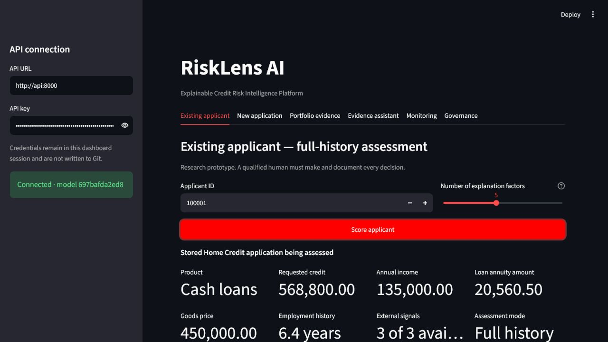
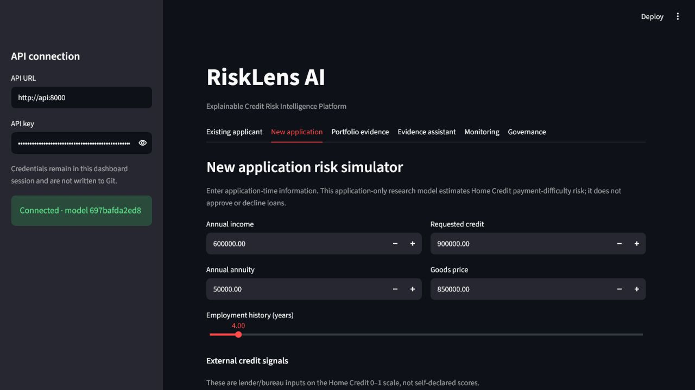
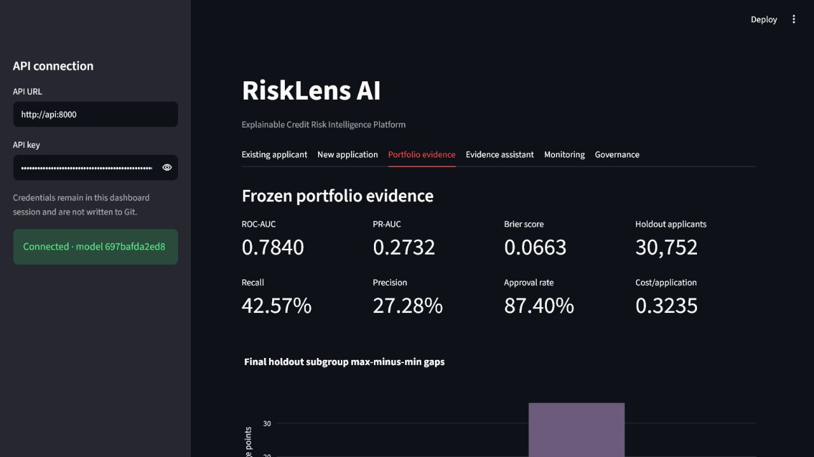
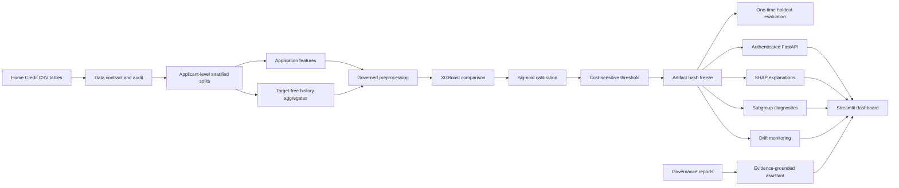

# RiskLens AI

### Explainable Credit Risk Intelligence Platform

[](https://github.com/lucifersaha02/risklens-ai/actions/workflows/ci.yml)
[](https://www.python.org/)
[](https://docs.docker.com/compose/)
[](LICENSE)

RiskLens AI is an end-to-end credit-risk decision-support research platform built on the
[Home Credit Default Risk](https://www.kaggle.com/competitions/home-credit-default-risk/data)
dataset. It combines leakage-safe relational feature engineering, calibrated XGBoost models,
SHAP explanations, subgroup diagnostics, drift monitoring, evidence-grounded retrieval,
authenticated FastAPI endpoints, and an interactive Streamlit dashboard.

> [!IMPORTANT]
> This is an educational research prototype—not a production lending system. It does not
> automatically approve or decline loans, provide adverse-action notices, or establish legal
> or regulatory compliance. A qualified human must review and document every decision.



## Why this project exists

A leaderboard model is only one part of an industry data-science system. RiskLens demonstrates
the broader lifecycle: data contracts, reproducible splits, model comparison, probability
calibration, frozen decision policy, one-time holdout evaluation, explainability, responsible-AI
diagnostics, model governance, serving, monitoring, containerization, and CI.

## Two governed assessment modes

| Mode | Input | Model | Purpose |
|---|---|---|---|
| Existing applicant | Stored Home Credit application plus aggregated bureau, previous-application, instalment, credit-card, and POS history | Frozen full-history calibrated XGBoost | Demonstrate scoring with relational history and local SHAP reasons |
| New application simulator | Manually entered application-time fields | Separately trained application-only calibrated XGBoost | Assess a hypothetical new application without inventing unavailable history |

Both modes estimate the probability of the Home Credit `TARGET` outcome: payment difficulty
defined by the competition. The output is a risk estimate and human-review route, not a lending
decision.



## Frozen evaluation results

The primary model was frozen before a one-time final holdout evaluation. Model development is
closed; these results must not be used for post-holdout tuning.

| Metric | Full-history holdout | New-application simulator test |
|---|---:|---:|
| Applicants | 30,752 | 21,526 |
| ROC-AUC | **0.7840** | **0.7560** |
| PR-AUC | **0.2732** | **0.2286** |
| Brier score | **0.0663** | **0.0684** |
| Recall at locked threshold | 42.57% | 36.42% |
| Precision at locked threshold | 27.28% | 24.56% |

The locked threshold is `0.166667`, derived from a documented hypothetical 5:1
false-negative:false-positive cost assumption. It is a portfolio experiment, not a lender's
financial estimate. See the [final holdout report](reports/final_holdout_report.md) and
[model card](reports/model_card.md) for confidence intervals, calibration, limitations, and
governance details.



## System architecture



## Data-science design

- **Data contract:** validates required Home Credit tables, schemas, row counts, primary keys,
  and target behavior before modeling.
- **Leakage control:** deterministic applicant-level 70/10/10/10 train, validation,
  calibration, and holdout partitions; target-free history aggregation by `SK_ID_CURR`.
- **Modeling:** dummy and logistic baselines followed by application-only and full-history
  XGBoost candidates with three-fold cross-validation.
- **Calibration:** sigmoid and isotonic methods compared on an internally reserved portion of
  the calibration partition; sigmoid selected by Brier score and log loss.
- **Governance:** candidate model, calibrated model, configuration, policy, and hashes frozen
  before the final holdout was accessed once.
- **Explainability:** global and applicant-level SHAP analysis in raw XGBoost-margin space;
  business-friendly labels remain traceable to technical feature names.
- **Responsible AI:** gender and age-band subgroup metrics are diagnostic only. Direct gender,
  age, and family-status fields are excluded from scoring but retained for auditing.
- **Monitoring:** prediction and feature PSI compare the frozen reference population with the
  unlabeled competition test population; alerts do not authorize model tuning.
- **Evidence assistant:** retrieves only from trusted project reports, returns citations, and
  refuses applicant-specific or autonomous-decision questions.

## Feature governance

The policy `sensitive_attributes_audit_only_v1` excludes these fields from model preprocessing
and scoring:

- `CODE_GENDER`
- `DAYS_BIRTH`
- `AGE_YEARS`
- `NAME_FAMILY_STATUS`

Exclusion does not prove fairness: proxy effects and materially different subgroup behavior can
remain. The final age-band recall and false-positive-rate gaps require investigation before any
real-world consideration.

## Technology stack

| Area | Tools |
|---|---|
| Data and modeling | pandas, NumPy, scikit-learn, XGBoost, PyArrow |
| Explainability and diagnostics | SHAP, Plotly, Matplotlib, subgroup metrics, PSI |
| API and UI | FastAPI, Pydantic, Uvicorn, Streamlit, HTTPX |
| Evidence retrieval | sentence-transformers, FAISS, trusted-source citations |
| Engineering | Typer CLI, pytest, Ruff, GitHub Actions |
| Deployment | Docker, Docker Compose, non-root read-only containers |

## Repository structure

```text
risklens-ai/
├── .github/workflows/     # CI quality, test, Compose, and image-build gates
├── configs/               # Data, modeling, monitoring, simulator, and RAG contracts
├── data/                  # Git-ignored raw/interim/processed data plus usage guide
├── docs/images/           # Portfolio screenshots
├── models/                # Git-ignored trained artifacts
├── reports/               # Compact model, holdout, fairness, SHAP, RAG, and drift evidence
├── src/risklens/          # Installable application package
├── tests/                 # Unit and API integration tests
├── Dockerfile
├── docker-compose.yml
└── pyproject.toml
```

## Local development

Requirements: Python `3.12`, Git, and enough memory/disk for the Home Credit dataset and feature
artifacts.

```powershell
git clone https://github.com/lucifersaha02/risklens-ai.git
cd risklens-ai
py -3.12 -m venv .venv
Set-ExecutionPolicy -Scope Process -ExecutionPolicy RemoteSigned
.\.venv\Scripts\Activate.ps1
python -m pip install --upgrade pip
python -m pip install -e ".[api,rag,dev]"
```

Download the competition archive directly from Kaggle, accept its rules, and extract the CSVs
under `data/raw/home_credit/`. Raw and generated datasets are deliberately excluded from Git.
The expected files are documented in [data/README.md](data/README.md).

Validate the environment:

```powershell
risklens validate-data
risklens audit-data
ruff check src tests
ruff format --check src tests
pytest tests/unit tests/integration --no-cov -q
```

## Reproduce the model lifecycle

Commands are intentionally explicit so that evidence is generated in order:

```powershell
risklens create-splits
risklens train-baselines
risklens train-candidate
risklens build-history-features
risklens train-full-history
risklens calibrate-full-history
risklens define-full-history-policy
risklens evaluate-full-history-fairness
risklens explain-full-history
risklens build-model-card
```

The next command permanently records the one-time final holdout result. Run it only after the
artifacts and policy are frozen:

```powershell
risklens evaluate-final-holdout --confirm
```

Build the remaining serving evidence:

```powershell
risklens train-new-application-simulator
risklens build-monitoring-baseline
risklens monitor-test-population
risklens build-knowledge-index
risklens evaluate-knowledge-retrieval
```

## Docker Compose deployment

Docker packages the code and dependencies. Governed data, model, and report artifacts remain
outside the image and are mounted read-only into the API container.

```powershell
Copy-Item .env.example .env
# Replace the placeholder in .env with a long random local secret.
docker compose config
docker compose build
docker compose up -d
docker compose ps
```

Open:

- Dashboard: <http://127.0.0.1:8501>
- Authenticated API documentation: <http://127.0.0.1:8000/docs>
- API health: <http://127.0.0.1:8000/health>

Stop the local stack with `docker compose down`.

Security controls include non-root processes, read-only filesystems, dropped Linux capabilities,
`no-new-privileges`, localhost-only published ports, health checks, and private
dashboard-to-API networking. These controls improve reproducibility and local isolation; they
are not a claim of production bank security.

## Continuous integration

GitHub Actions runs on pushes and pull requests to `main` and enforces:

1. Python 3.12 dependency installation
2. Ruff lint and formatting checks
3. All unit and API integration tests
4. Docker Compose validation
5. A complete non-root runtime-image build

CI does not require or publish the private Kaggle data, trained model binaries, `.env`, or API
keys. Compact Markdown/JSON governance reports are intentionally versioned as portfolio evidence.

## Responsible use and limitations

- Home Credit data is historical, anonymized competition data and is not representative of every
  population, geography, product, or economic period.
- `TARGET` is the competition's payment-difficulty outcome—not proof that a borrower will never
  repay an entire loan.
- External source fields are opaque and would require vendor documentation and governance.
- The new-application simulator is application-only and cannot substitute for missing bureau or
  repayment history.
- SHAP explains model behavior, not causality or legally sufficient adverse-action reasons.
- Subgroup metrics do not prove fairness or legal compliance.
- Monitoring on unlabeled data measures distribution shift, not performance degradation.
- Real deployment would require lender-owned data validation, privacy review, security testing,
  audit logging, model-risk management, legal review, and ongoing outcome monitoring.

## Evidence and documentation

- [Governed model card](reports/model_card.md)
- [One-time final holdout report](reports/final_holdout_report.md)
- [Responsible-AI report](reports/full_history_responsible_ai_report.md)
- [SHAP explainability report](reports/shap_explainability_report.md)
- [New-application simulator card](reports/new_application_simulator_model_card.md)
- [Monitoring snapshot](reports/monitoring_report.md)
- [RAG retrieval evaluation](reports/rag_retrieval_report.md)

## License

Released under the [MIT License](LICENSE). The Home Credit dataset is not included and remains
subject to Kaggle's competition rules.
